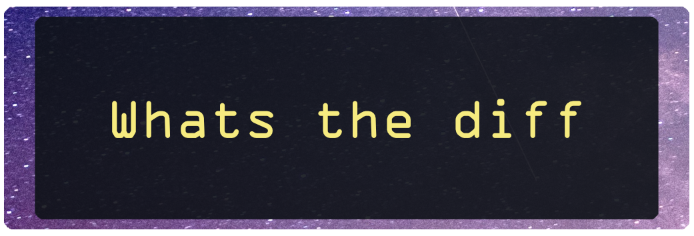

  
<h3 align="center">Differentiate texts by CLI</h3>
<p align="center">
    <a href="#Installation">Installation</a> •
    <a href="#Usage">Usage</a> •
    <a href="#WIP">WIP</a> •
    <a href="#License">License</a>
</p>

---

## Description  

This script was written as a fairly simple showcase for String manipulation quite some time ago, it may be a usefull reference for beginners.  
It takes in two user inputs, compares them and prints out, color coding the diverging parts.
  
---
  
## Installation  
  
The only prerequisite is [**Python**](https://www.python.org/downloads/).

```bash
git clone https://github.com/Daniel-RRR/WhatsTheDiff.git
```
  
---
  
## Usage  
  
Run without any parameter to enter your texts as prompt
````bash
python main.py
````  
  
---
  
## WIP
  

  
---
  
## License

This project is licensed under the terms of the
[GNU General Public License v3.0](https://choosealicense.com/licenses/gpl-3.0).  
  
  
  